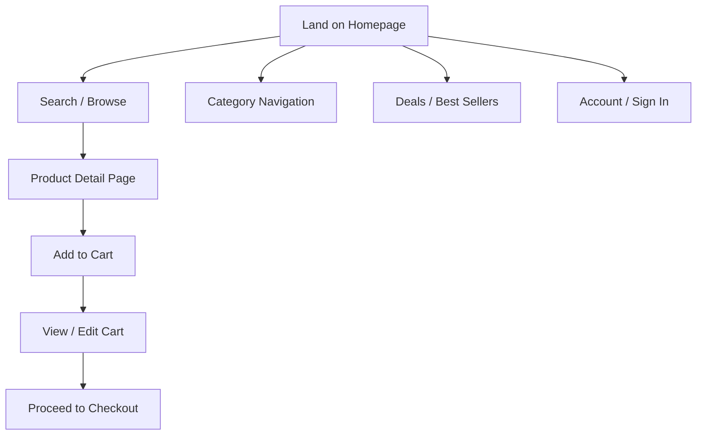

# Amazon.in — Application Context

## What We Are Testing

Amazon.in is a full-featured ecommerce platform. This project validates customer-facing flows that affect shopping experience, conversion, and trust — without completing real transactions.

## Core User Journeys

## Feature Areas & Test Scope

### 1. Homepage & Navigation

| Type | Scenarios |
|------|-----------|
| Regression | Homepage loads, logo visible, search bar present, main nav categories accessible |
| Positive | Click category from nav, navigate to Today's Deals, footer links work |
| Negative | Invalid deep-link returns error or redirect |
| Edge | Page refresh preserves session cart count (guest), back button from PDP |

### 2. Search

| Type | Scenarios |
|------|-----------|
| Regression | Search with common term returns results (e.g. "laptop", "books") |
| Positive | Select suggestion from autocomplete, filter/sort results, open first result |
| Negative | Empty search submit, gibberish term with no results, special chars only (`!!!`) |
| Edge | Very long query, leading/trailing spaces trimmed, search from category page |

**Stable search terms** (use in tests — less flaky):
- `books` — high availability
- `pen` — short, common
- `xyznonexistentproduct12345` — predictable zero results

### 3. Product Listing (SRP) & Product Detail (PDP)

| Type | Scenarios |
|------|-----------|
| Regression | SRP shows product cards; PDP loads title, price, Add to Cart |
| Positive | Change quantity, view images, scroll to reviews section |
| Negative | Out-of-stock product shows unavailable state |
| Edge | Product with no reviews, product with variants (size/color if applicable) |

### 4. Cart

| Type | Scenarios |
|------|-----------|
| Regression | Add item from PDP → cart badge updates → cart page shows item |
| Positive | Update quantity, remove item, continue shopping |
| Negative | Set quantity to 0 or remove all items → empty cart message |
| Edge | Add same item twice, cart subtotal reflects quantity |

### 5. Location / Delivery (Pincode)

| Type | Scenarios |
|------|-----------|
| Regression | Enter valid pincode → delivery info appears |
| Positive | Change pincode on PDP |
| Negative | Invalid pincode (e.g. `000000`, `abcde`) shows error |
| Edge | Pincode with leading zeros (e.g. `110001`) |

**Test pincodes**: `110001` (Delhi), `400001` (Mumbai), `560001` (Bangalore)

### 6. Account & Sign In (limited scope)

| Type | Scenarios |
|------|-----------|
| Regression | Sign-in page loads from account link |
| Positive | Valid credentials via env vars (`AMAZON_EMAIL`, `AMAZON_PASSWORD`) — optional, isolated tests only |
| Negative | Invalid email format, wrong password shows error |
| Edge | Empty email and password fields |

> Account tests are **optional**. Default regression runs as guest user only.

### 7. Checkout (read-only boundary)

| Type | Scenarios |
|------|-----------|
| Regression | Proceed to checkout from cart reaches sign-in or address step |
| Positive | — |
| Negative | — |
| Edge | — |

**Stop before payment.** Do not enter card details or confirm orders.

## Common UI Interruptions

Handle these before asserting on main content:

1. **Location/pincode popup** — dismiss or set pincode
2. **Sign-in overlay** — close if blocking (click X or Continue shopping)
3. **Cookie/consent banners** — accept or dismiss if present
4. **Language preference** — default to English

Dismiss overlays via `pages/base.page.ts` (`BasePage`) before asserting on main content — no separate seed spec file.

## Dynamic Content Rules

Amazon pages change frequently. Write tests that survive:

| Dynamic | Strategy |
|---------|----------|
| Prices | Assert price element exists, not exact value |
| Product titles | Assert non-empty, or match partial regex |
| Availability | Assert status text matches `/in stock\|available\|currently unavailable/i` |
| Rankings | Do not assert exact position in search results |
| Ads/sponsored | Target organic results or use `nth()` cautiously |

## Regression Suite (Minimum Smoke)

These scenarios must pass on every regression run (`@regression`):

1. Homepage loads with search bar and navigation
2. Search "books" returns results page with products
3. Open a product from search results → PDP loads
4. Add product to cart → cart count increases
5. Cart page displays added item with title and quantity
6. Remove item from cart → empty cart state
7. Enter valid pincode → delivery information shown
8. Category navigation from homepage works

## Test Data

| Data | Value | Notes |
|------|-------|-------|
| Base URL | `https://www.amazon.in` | Set in playwright.config.ts |
| Search (positive) | `books`, `pen` | Reliable results |
| Search (negative) | `` (empty), `xyznonexistentproduct12345` | No results / validation |
| Pincode (valid) | `110001` | Delhi |
| Pincode (invalid) | `000000`, `abcde` | Error expected |
| Credentials | `.env` only | Optional, never committed |

## Out of Scope

- Payment gateway / order placement
- Seller Central / admin panels
- Mobile app (web responsive tests optional later)
- Performance / load testing
- API-level testing (UI E2E only)
